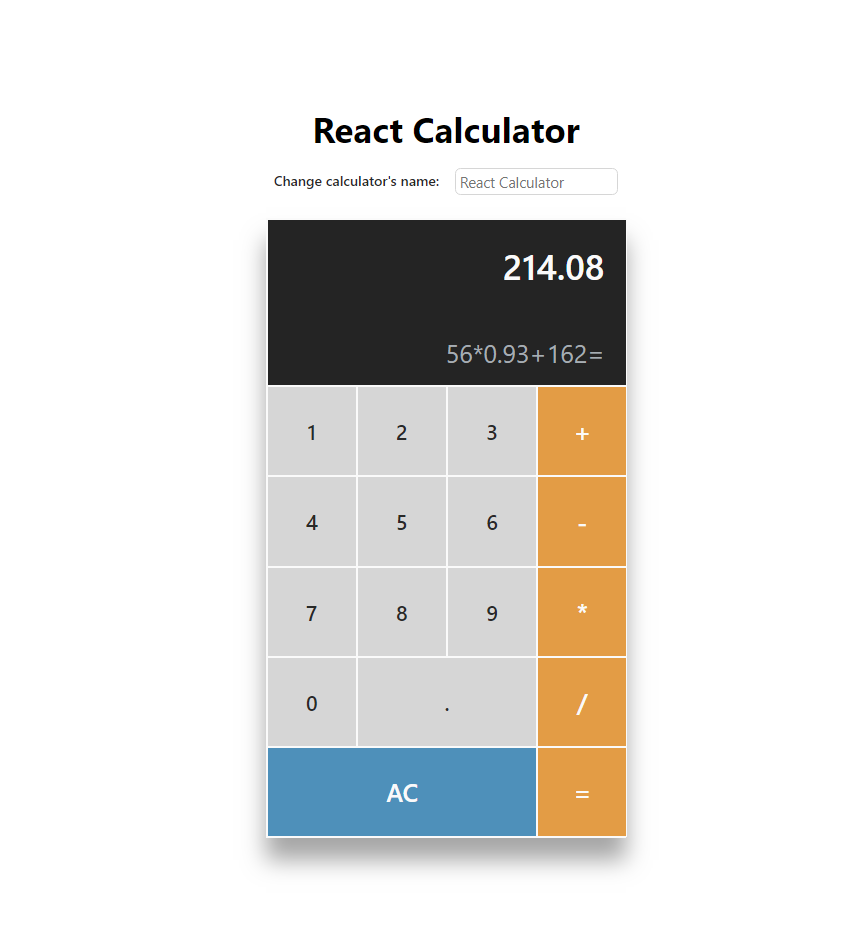

# React Calculator App

A simple calculator app created using React + Hooks + Typescript

## Features
- Perform basic calculations
- Change calculator's name live

## To run the app with React
1. Run `npm install`
2. Run `npm start`
3. Open the app in `http://localhost:3000`

This project was bootstrapped with [Create React App](https://github.com/facebook/create-react-app).

